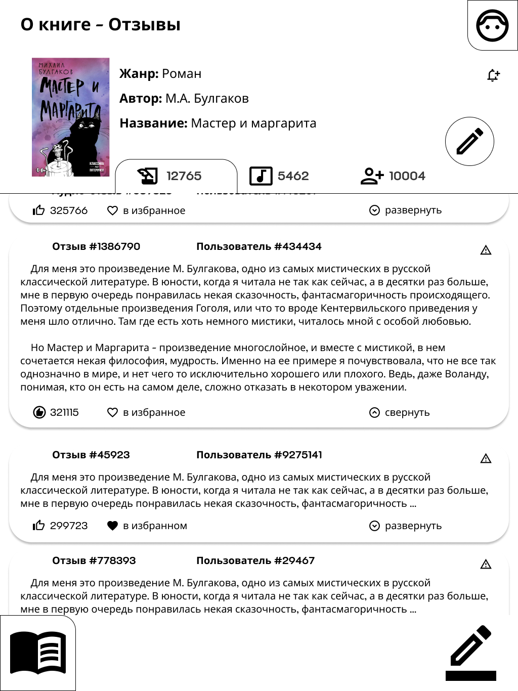
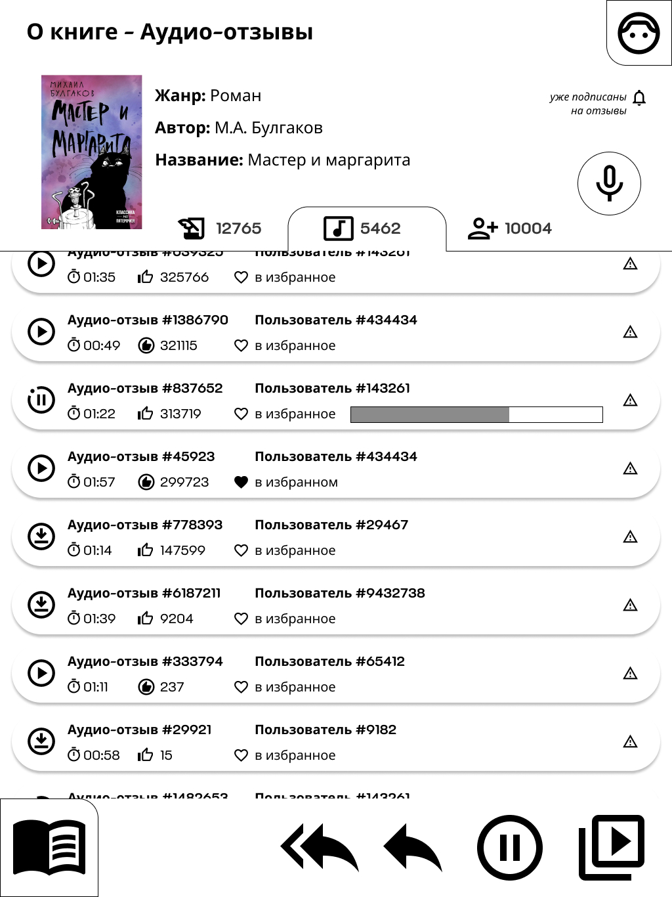
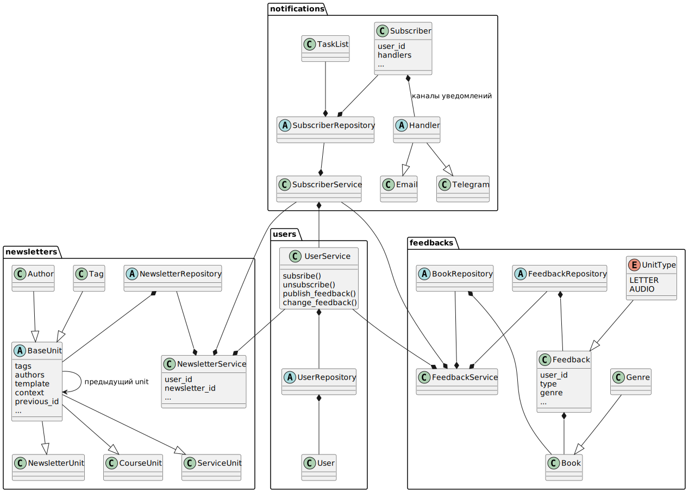

[github репозиторий с исходниками](https://github.com/shishkinav/the-edtech-press)

# Пользовательские сценарии

## Сценарий "Поиск книги для фиксации отзыва"

### Порядок действий

**Есть** авторизованный пользователь

**И есть** модуль "Электронного читательского дневника"

**И** пользователь выбирает в каталоге интересующий его **Жанр**

**Или** пользователь вводит в строке поиска автора | название книги

**Тогда** появляется список найденных наименований книг, подходящих под запрос пользователя

**И** в каждой карточке книги пользователь видит:
* название
* автор
* жанр
* кол-во отзывов

**Когда** пользователь нажимает на карточку книги

**Тогда** пользователь переходит на страницу с детальным описанием и списком отзывов других пользователей к ней




### Доменная модель - существительные
* Пользователь добавляет письменный отзыв
* Пользователь добавляет аудио отзыв
* Пользователь получает каталог жанров
* Пользователь получает список отзывов на Книгу

### Системные операции - глаголы
* Пользователь публикует отзыв на книгу
* Пользователь может скрыть свой отзыв
* Пользователь может отредактировать свой отзыв


## Сценарий "Подписка/отписка на email рассылки"
### Порядок действий

**Есть** авторизованный пользователь

**И есть** модуль "Образовательных рассылок"

**И** пользователь выбирает в каталоге интересующий его **Тег**

**Или** пользователь вводит в строке поиска название образовательной рассылки

**Тогда** появляется список найденных образовательных рассылок, подходящих под запрос пользователя

**И** в каждой карточке объекта пользователь видит:
* название рассылки
* привязанные теги
* признак подписан или нет этот пользователь

**Когда** пользователь нажимает на карточку рассылки

**Тогда** пользователь переходит на страницу с детальной информацией по образовательной рассылки и доступными действиями "Подписаться" / "Отписаться"

### Доменная модель - существительные
* Пользователь подписывается на образовательную или информационную рассылку
* Пользователь отписывается от образовательной или информационной рассылку

### Системные операции - глаголы
* Пользователь получает на email:
    * системные письма
    * письма с образовательным или информационным контентом по установленному расписанию рассылки


# Общая схема взаимодействия сервисов



# Назначение сервисов и контракты взаимодействий

## **notifications - Сервис "Уведомлений"**
### Название
Уведомитель пользователей

### Запросы
GET `api/v1/notifications/<task_id>/get_status` - получение информации по отправке

response
```
{
    task_id: int,
    results: [
        {
            user_id: int,
            newsletter_id: int,
            status: send | processing | error
        }, ...
    ]
}
```

### Команды
PUT `api/v1/notifications/<user_id>/subscribe` - добавление каналов оповещения
```
{
    handle: telegram
}
```

DELETE `api/v1/notifications/<user_id>/unsubscribe` - удаление каналов оповещения
```
{
    handle: telegram
}
```

POST `api/v1/notifications/send` - запланировать массовую отправку уведомления
```
{
    user_ids: List[int],
    newsletter_id: int,
    start_date: Optional[datetime]
}
```
response
```
{
    status: OK,
    task_id: int,
    start_date: datetime
}
```

### События

### Зависимости
* слушает события `SubsrciptionChanged` от сервиса Пользователей и фиксирует изменения handlers
* слушает события `ObjectCreated` от сервиса Рассылок контента и сервиса Отзывов и генерирует массовые рассылки для подписчиков

## **users - Сервис "Управление пользователями"**
### Название
Пользователи

### Запросы
GET `api/v1/users/<user_id>/profile` - получение информации о пользователе

### Команды
PUT `api/v1/users/<user_id>/profile` - редактирование информации о пользователе

### События
* публикует событие `SubsrciptionChanged`

### Зависимости


## **feedbacks - Сервис "Управление отзывами"**
### Название
Отзывы на книги

### Запросы
GET `api/v1/feedbacks/genre/list` - список имеющихся жанров

GET `api/v1/feedbacks/book/list?q=phrase&genre=2&limit=20&page=3` - пагинируемый список всех книг под запрос или с дефолтными параметрами

GET `api/v1/feedbacks/book/<book_id>` - получение статистики отзывов пользователей о книге

GET `api/v1/feedbacks/<feedback_id>/book/<book_id>` - получение детальной информации по кнокретному отзыву на книгу

### Команды
POST `api/v1/feedbacks/book/<book_id>` - пользователь создаёт отзыв на книгу
```
{
    type: letter | audio
    content: str | binary
}
```

PUT `api/v1/feedbacks/book/<book_id>` - пользователь хочет изменить отзыв на книгу
```
{
    type: letter | audio
    content: str | binary
}
```

### События
* публикует события `ObjectCreated` при создании нового отзыва на книгу

### Зависимости


## **newsletters - Сервис "Информационные и образовательные рассылки"**
### Название
Контент рассылок

### Запросы
GET `api/v1/newsletters/tag/list` - список имеющихся тегов образовательных и информационных рассылок

GET `api/v1/newsletters/author/list` - список публикующих рассылки авторов

GET `api/v1/newsletters/list?q=phrase&tag=2&limit=20&page=3` - пагинируемый список имеющихся рассылок под запрос или с дефолтными параметрами

GET `api/v1/newsletters/unit/<unit_id>` - получение детальной информации о рассылке

### Команды
POST `api/v1/newsletters/unit` - создание рассылки
```
{
    is_hidden: boolean (default - True)
    type: newsletter | course | service,
    template: str (url),
    context: dict,
    authors: Optional[List[str]],
    previous_id: Optional[int]
}
```

PUT `api/v1/newsletters/unit/<unit_id>` - изменение рассылки

### События
* публикует события `ObjectCreated` для опубликованной рассылки

### Зависимости
